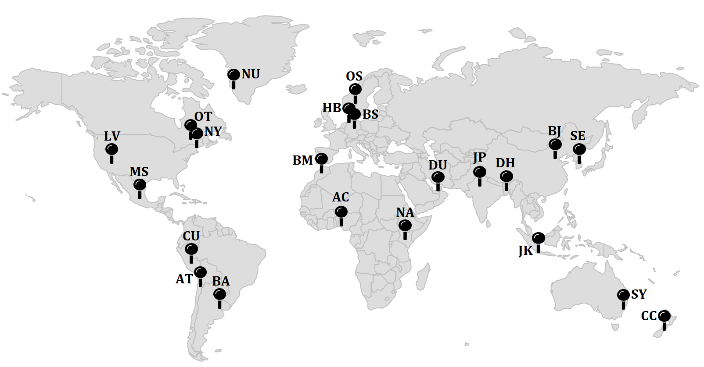
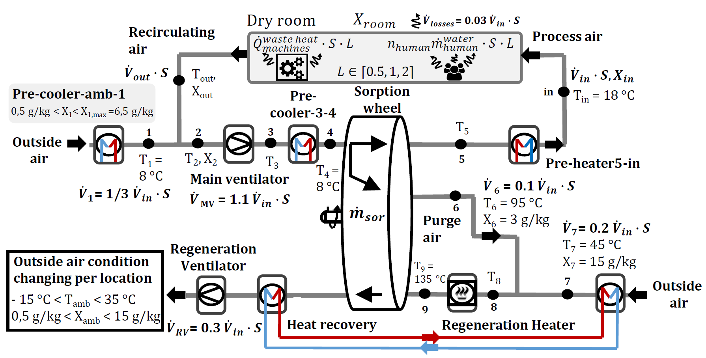

# Assessment of scale up and relocation of technical building services (TBS) for battery cell production

This folder contains comprehensive static and temporal data about the energy and power demand of TBS,
in particular HVAC systems supplying dry rooms for battery production.
22 locations around the world are considered and 10 size scales are available for each location. In addition, for each size scale
three variants of the internal loads (heat and moisture loads) were calculated. Therefore, 30 simulation variants are available per location.
This leads to a total of 660 simulation cases contained in the data sets.
With the data sets, supply air volume flows of 5500 m<sup>3</sup>/h - 99000 m<sup>3</sup>/h can be considered, which covers plant sizes from laboratory to industrial size scales.
The following world map shows the considered locations and abbreviations used in the data set:


**Figure 1:** World map showing the considered locations and abbreviations

| BS  | Braunschweig (GER) | DH  | Dhaka (BGD)          | NU  | Nuuk (GRL)    | SE  | Seoul (KOR)       | OS  | Oslo (NOR)         |
| --- | ------------------ | --- | -------------------- | --- | ------------- | --- | ----------------- | --- | ------------------ |
| HB  | Bremen (GER)       | OT  | Ottawa (CAN)         | JK  | Jarkata (IND) | BM  | Beni Mellal (MAR) | CC  | Christchurch (NZL) |
| BA  | Buenos Aires (ARG) | AT  | Atacama Desert (CHL) | JP  | Jaipur (IND)  | MS  | Mexico City (MEX) | CU  | Cusco (PER)        |
| SY  | Sydney (AUS)       | BJ  | Beijing (CHN)        | NA  | Nairobi (KEN) | AC  | Accra (GHA)       | LV  | Las Vegas (USA)    |
| NY  | New York (USA)     | DU  | Dubai (UAE)          |

This folder is organised as follows:

```
dataSetTBSbatteryCellProduction
│   energeticEvaluations.py
|   energeticEvaluationsMultiOutputRegression.py
│   manualAnalysis.py
│   README.md
│   License.md
│   environment.yml
│   requirements.txt
│
└───data
│   │   automateSimulationDynamicResults.csv
│   │   automateSimulationStaticResults.csv
│
└───helpers
│   │   helperFuncs.py
│   │   rc_parameters_matplotlib.py
│   │   WetAirToolBox.py
│   │   stackingEstimator.py
│
└───images
    │   ConsideredLocationsWorldMapReadMe.png
    │   PhysicalSystemBLBComponents.PNG
    │   Plotted files generated by manualPlotting.py
    │   ...
```

The most important contents of the folder are briefly described below.
`energeticEvaluations.py`: This script is intended to provide a quick introduction to an energetic evaluation based on the available data.
To use the data set, first define the important **boundary parameters** presented in the paper.
Then the script performs a suitable interpolation on the basis of the static data set `automateSimulationStaticResults.csv`.
The content of `automateSimulationStaticResults.csv` is also described further below.
The results of this script can then be used for energetic evaluations of TBS for battery cell production.

`energeticEvaluationsMultiOutputRegression.py`:
The static data set only contains a limited amount of locations, due to the high computational effort that is involved to simulate the complex HVAC model for a complete typical year.
The purpose of this script is to interpolate the energy demands of the HVAC system for locations not included in the static data set.
To achieve this, a multi-in and output regression problem must be solved.
A scikit-learn machine learning model is used for this purpose. A suitable model for regression has already been found using an automated machine learning approach (with the help of TPOT using 100 generations and a population size of 100).
A different location changes the external weather conditions in relation to the model, in this case outdoor temperature and humidity.
The idea now is to take the mean temperature and the mean humidity as input and use the machine learning model on the
static data set `automateSimulationStaticResults.csv` to interpolate the corresponding energy demands of the HVAC system using a regression approach.
The other **boundary parameters** to specify the dry room planning can be set as usual.

`manualAnalysis.py`: This script generates the box-plot shown in the paper for the three load variants considered.
In addition, a line plot based on the temporal energy demand of a simulation case is shown.

## Disclaimer
> The three scripts made available are only an initial suggestion for the evaluation of the data set and
> they are intended to simplify the work with the provided data from the user's point of view.
> No claim is made for completeness. On the basis of the data provided, various further  
> in-depth evaluations are possible, such as more detailed temporal evaluations based on the
> `automateSimulationDynamicResults.csv` data set.
> In addition, the data sets can be used as a basis to perform various other regressions,
> which is only demonstrated as an example in the script `energeticEvaluationsMultiOutputRegression.py`.

`helpers` Folder: Helper functions for `energeticEvaluations.py`, `manualAnalysis.py` and `energeticEvaluationsMultiOutputRegression.py`

`environment.yml`: Conda environment to run the python scripts.

`images`: Folder created by `manualAnalysis.py` where plots can be stored.

## HVAC system components and parameters

In order to be able to better identify the data point names contained in the data sets,
the system diagram of the underlying HVAC system is shown in the following Figure.


**Figure 2:** HVAC system components and scaling with scaling factor `S` and load scaling factor `L`

## Detailed documentation of the available data

### Static data: `automateSimulationStaticResults.csv`

| Data point name                     | Description                                                                                                                                                                                                                                        |
| :---------------------------------- | :------------------------------------------------------------------------------------------------------------------------------------------------------------------------------------------------------------------------------------------------- |
| ScalingFactorS                      | Dimensionless calculated scaling factor.                                                                                                                                                                                                           |
| LoadScalingFactor                   | Load scaling factor, also used to group data.                                                                                                                                                                                                      |
| electricEnergyKwh                   | Aggregated electrical energy demand over the period under consideration in kWh. Includes electricity demand of the fans and electrical energy demand for cooling by means of a compression refrigeration machine based on a cooling number of 2.5. |
| naturalGasEnergyKwh                 | Aggregated thermal energy demand over the period under consideration for regeneration heater in kWh.                                                                                                                                               |
| districtHeatingEnergyKwh            | Aggregated thermal energy demand over the period under consideration for supply air heater and preheating of ambientairflow in kWh.                                                                                                                |
| volumeFlowMainVentilatorM3H         | Maximum volume flow of the process air in m³/h                                                                                                                                                                                                     |
| PowerDemandMainVentilator           | Maximum power demand of the process ventilator in W                                                                                                                                                                                                |
| TemperatureBeforeMainVentilator     | Maximum temperature before the process ventilator in K                                                                                                                                                                                             |
| TemperatureAfterMainVentilator      | Maximum temperature after the process ventilator in K                                                                                                                                                                                              |
| volumeFlowRegenerationVentilatorM3H | Maximum volume flow of the regeneration ventilator in m³/h                                                                                                                                                                                         |
| PowerDemandRegenerationVentilator   | Maximum power demand of the regeneration ventilator in W                                                                                                                                                                                           |
| TemperatureRegenerationHeater       | Maximum temperature after the regeneration heater in K                                                                                                                                                                                             |
| HeatFlowRegenerationHeater          | Maximum heat flow of the regeneration heater in W                                                                                                                                                                                                  |
| HeatFlowPreCooler-amb-1             | Maximum heat flow of the first pre-cooler in W                                                                                                                                                                                                     |
| TemperaturePreCooler-amb-1          | Maximum temperature behind the first pre-cooler in K                                                                                                                                                                                               |
| HeatFlowPreCooler-3-4               | Maximum temperature of the second pre-cooler in K                                                                                                                                                                                                  |
| TemperaturePreCooler-3-4            | Maximum temperature behind the second pre-cooler in K                                                                                                                                                                                              |
| HeatFlowPreHeater-5-In              | Maximum heat flow of the pre-heater in W                                                                                                                                                                                                           |
| TemperaturePreHeater-5-In           | Maximum temperature behind the pre-heater in K                                                                                                                                                                                                     |
| FluidTemperatureInHeatRecoveryUnit  | Maximum temperature of the heated fluid of the heat recovery unit in K                                                                                                                                                                             |
| TemperatureInPurgeAir               | Maximum temperature in the purge air in K                                                                                                                                                                                                          |
| DewPointTemperatureDryRoom          | Maximum dew point temperature in the dry room °C                                                                                                                                                                                                   |
| TemperatureDryRoom                  | Maximum temperature of the dry room K                                                                                                                                                                                                              |
| DryRoomHeatLoad                     | Maximum heat load of the machines in the dry room in W                                                                                                                                                                                             |
| DryRoomMoistureLoad                 | Maximum moisture load caused by people, door openings, leakages, ... in kg<sub>H<sub>2</sub>O</sub>/s                                                                                                                                              |
| OutsideRelativeHumidity             | Averaged relative humidity of the ambient                                                                                                                                                                                                          |
| OutsideTemperatureDegrees           | Averaged temperature of the ambient in °C                                                                                                                                                                                                          |
| locationVariant                     | Simulation case for certain variant e.g. "OS-2"                                                                                                                                                                                                    |
| location                            | Location without variant number for grouping data.                                                                                                                                                                                                 |
| finalEnergy                         | Total energy consumption of main components of the HVAC-System in kWh                                                                                                                                                                              |

### Dynamic data: `automateSimulationDynamicResults.csv`

The data set starts on 01.01. 00:00:00 h of a generic type year and
ends on 31.12. 24:00:00 h at an hourly time step. The data contained in the static data set are also present in the dynamic data set. The data points are identified by the **locationVariant** and the **data point name** (same as in the static data set)
e.g. **OS-2-electricEnergyKwh**. For each simulation case per location, the dynamic data set is then structured as follows:

| timestep (s) | OS-2-ScalingFactorS | OS-2-LoadScalingFactor | OS-2-electricEnergyKwh | OS-2-naturalGasEnergyKwh | ... |
| -----------: | ------------------: | ---------------------: | ---------------------: | -----------------------: | --: |
|            0 |                 0.5 |                    0.5 |                      0 |                        0 | ... |
|       3603.6 |                 0.5 |                    0.5 |                22.4651 |                  16.4294 | ... |
|      7207.21 |                 0.5 |                    0.5 |                48.2471 |                  33.4494 | ... |
|      10810.8 |                 0.5 |                    0.5 |                62.5932 |                  50.3378 | ... |
|      14414.4 |                 0.5 |                    0.5 |                81.3516 |                  67.2197 | ... |

## A glance into this repository
The scripts `energeticEvaluations`, `energeticEvaluationsMultiOutputRegression` and `manualAnalysis` can be tested via Binder 
if you want to take a look online without setting up or installing anything:

<a href="https://mybinder.org/v2/gh/HVAC-in-industry/TBS-scale-up-Relocation/HEAD" target="_blank" rel="noopener noreferrer">
    
</a>

## How to cite

If you use this software, please cite the following paper:

> Marcus Vogt, Antal Dér, Usama Khalid, Felipe Cerdas, Christoph Herrmann,
> Model-based planning of technical building services and process chains for battery cell production,
> Journal of Cleaner Production,
> Volume 370,
> 2022,
> https://doi.org/10.1016/j.jclepro.2022.133512

## Installation
Either conda or pip virtual environment can be used for installation. 
On Windows use the following commands for installation of the environment in the command line after navigating to the root of this repository.

Via conda:
```
conda env create -f environment.yml
```
```
conda activate envDataSetEvalPy3.8
```

Via pip virtual environment:
```
python -m venv envDataSetEvalPy3.8
```
```
.\envDataSetEvalPy3.8\Scripts\activate
```
```
pip install -r requirements.txt
```

## Limitations

- A dew point of -60 °C is assumed in the process air in the model. A change in the process air dew point affects
  the dimensioning of the sorption wheel and thus also has an influence on the energy demand of the regeneration heater.
  For dew points well beyond -60 °C in the process air, the data could potentially be less accurate.
- A constant total pressure increase of 1800 Pa and efficiency of 70 % of the fans is assumed.
  If the design of the HVAC system changes drastically compared to the Battery LabFactory (BLB) case study presented in the paper,
  this might lead to a change in the total pressure, as well as a change of pressure loss in the system that needs to compensated by the fans,
  resulting in deviations of the energy demands of the fans calculated in the data set.
- Due to the controls of the cooling and heating coils, which have been developed in detail for the case of the BLB,
  deviations of the calculated energy demands of the cooling and heating coils in comparison to the real operation can occur
  in climatically very different regions. As a result, the calculated energy demands of the cooling and heating coils
  can deviate from real operation in climatically very different regions.
- A five-day week with continuous production is assumed. There is no production at the weekend and the system
  and the system switches to economy mode with reduced volume flow and a reduced dew point temperature during weekends.
  If production also takes place at weekends the aggregated energy values of the system may deviate.
  For a more precise calculation, the available dynamic power requirements of the main components of the system in the
  `automateSimulationDynamicResults.csv` data set can be used.
